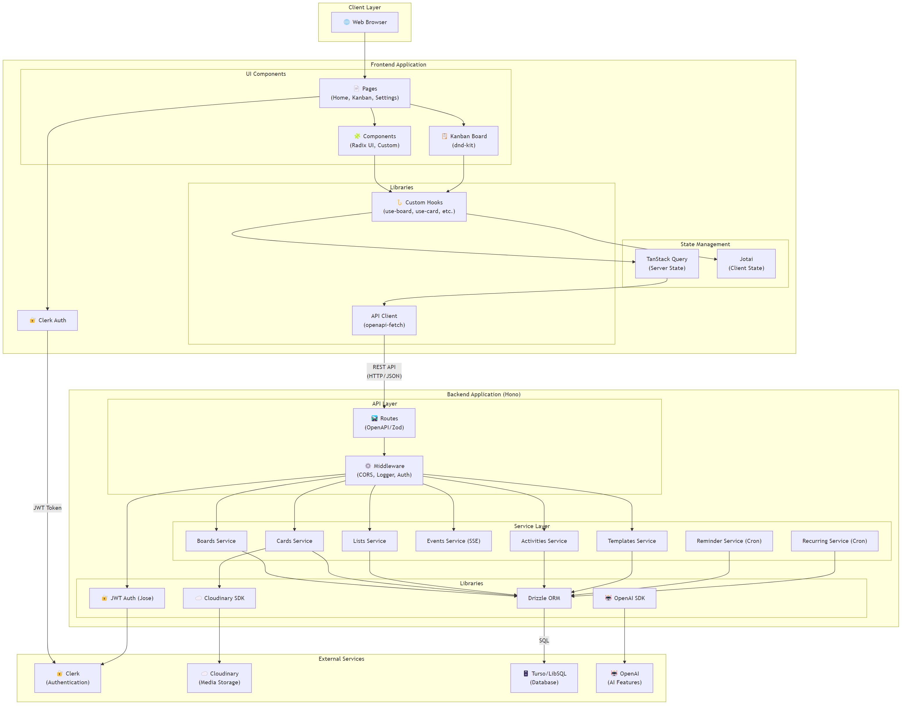

# ĐẶC TẢ KIẾN TRÚC HỆ THỐNG DAILYDESK

## 1. TỔNG QUAN

DailyDesk là ứng dụng quản lý công việc theo phong cách Kanban, được xây dựng theo kiến trúc **Client-Server** với mô hình **3-Tier Architecture** (3 tầng).

---

## 2. SƠ ĐỒ KIẾN TRÚC



---

## 3. MÔ TẢ CÁC TẦNG

### 3.1. Client Layer (Tầng Client)

| Thành phần | Mô tả |
|------------|-------|
| **Web Browser** | Trình duyệt web, nơi người dùng tương tác với ứng dụng |

---

### 3.2. Frontend Application (Tầng Giao Diện)

#### 3.2.1. UI Components

| Thành phần | Công nghệ | Chức năng |
|------------|-----------|-----------|
| **Pages** | React | Các trang chính: Home, Kanban, Settings |
| **Components** | Radix UI + Custom | Thành phần UI tái sử dụng |
| **Kanban Board** | dnd-kit | Bảng Kanban với tính năng kéo thả |

#### 3.2.2. State Management

| Thành phần | Công nghệ | Chức năng |
|------------|-----------|-----------|
| **TanStack Query** | @tanstack/react-query | Quản lý Server State, caching, fetching |
| **Jotai** | jotai | Quản lý Client State (UI state) |

#### 3.2.3. Libraries

| Thành phần | Công nghệ | Chức năng |
|------------|-----------|-----------|
| **Custom Hooks** | React Hooks | use-board, use-card, use-list, v.v. |
| **API Client** | openapi-fetch | Gọi API Backend |

#### 3.2.4. Authentication

| Thành phần | Công nghệ | Chức năng |
|------------|-----------|-----------|
| **Clerk Auth** | @clerk/clerk-react | Xác thực người dùng |

---

### 3.3. Backend Application (Tầng Nghiệp Vụ)

#### 3.3.1. API Layer

| Thành phần | Công nghệ | Chức năng |
|------------|-----------|-----------|
| **Routes** | Hono + OpenAPI/Zod | Định nghĩa API endpoints với validation |
| **Middleware** | Hono | CORS, Logger, Bearer Auth |

#### 3.3.2. Service Layer

| Service | Chức năng |
|---------|-----------|
| **Boards Service** | CRUD boards, quản lý bảng |
| **Cards Service** | CRUD cards, quản lý thẻ công việc |
| **Lists Service** | CRUD lists, quản lý cột trong bảng |
| **Events Service** | Server-Sent Events (SSE) cho real-time |
| **Activities Service** | Ghi log hoạt động |
| **Templates Service** | Quản lý board templates |
| **Reminder Service** | Cron job gửi nhắc nhở due date |
| **Recurring Service** | Cron job xử lý recurring tasks |

#### 3.3.3. Libraries

| Thành phần | Công nghệ | Chức năng |
|------------|-----------|-----------|
| **Drizzle ORM** | drizzle-orm | ORM cho database operations |
| **JWT Auth** | jose | Xác thực JWT token từ Clerk |
| **Cloudinary SDK** | cloudinary | Upload/quản lý media files |
| **OpenAI SDK** | openai | Tích hợp AI features |

---

### 3.4. External Services (Dịch Vụ Bên Ngoài)

| Service | Chức năng | Kết nối từ |
|---------|-----------|------------|
| **Clerk** | Authentication & User Management | Frontend + Backend |
| **Cloudinary** | Media Storage (images, attachments) | Backend |
| **Turso/LibSQL** | SQLite Database (Edge-ready) | Backend |
| **OpenAI** | AI Features (chat, suggestions) | Backend |

---

## 4. LUỒNG DỮ LIỆU

### 4.1. Luồng Request/Response

```
User → Browser → React UI → Custom Hooks → TanStack Query 
    → API Client → REST API (HTTP/JSON) → Hono Routes 
    → Middleware (Auth) → Services → Drizzle ORM → Database
```

### 4.2. Luồng Authentication

```
User → Clerk Auth (Frontend) → JWT Token 
    → API Request with Bearer Token → JWT Auth (Backend) 
    → Verify with Clerk JWKS → Authorized Request
```

---

## 5. CÔNG NGHỆ SỬ DỤNG

### 5.1. Frontend Stack

| Công nghệ | Phiên bản | Vai trò |
|-----------|-----------|---------|
| React | 19.x | UI Framework |
| Vite | 7.x | Build Tool |
| TypeScript | 5.x | Type Safety |
| TanStack Query | 5.x | Data Fetching |
| Jotai | 2.x | State Management |
| Radix UI | - | Headless Components |
| dnd-kit | 6.x | Drag & Drop |
| Tailwind CSS | 4.x | Styling |

### 5.2. Backend Stack

| Công nghệ | Phiên bản | Vai trò |
|-----------|-----------|---------|
| Node.js | 20.x | Runtime |
| Hono | 4.x | Web Framework |
| Drizzle ORM | 0.44.x | Database ORM |
| LibSQL | 0.15.x | SQLite Driver |
| Jose | 6.x | JWT Verification |
| Zod | 4.x | Schema Validation |

---

## 6. GIAO TIẾP GIỮA CÁC TẦNG

| Từ | Đến | Protocol | Format |
|----|-----|----------|--------|
| Frontend | Backend | HTTP/HTTPS | JSON (REST API) |
| Backend | Database | SQL | LibSQL Protocol |
| Backend | Cloudinary | HTTPS | REST API |
| Frontend | Clerk | HTTPS | OAuth 2.0 |
| Backend | Clerk | HTTPS | JWKS |

---

## 7. ĐẶC ĐIỂM KIẾN TRÚC

### 7.1. Ưu điểm

- **Separation of Concerns**: Tách biệt rõ ràng giữa UI, Logic, Data
- **Type Safety**: TypeScript + Zod validation end-to-end
- **Scalable**: Có thể deploy lên Edge (Cloudflare Workers)
- **Real-time**: SSE cho live updates
- **Offline-first**: TanStack Query caching

### 7.2. Patterns sử dụng

- **Repository Pattern**: Services layer abstract database operations
- **Dependency Injection**: Hono middleware inject auth context
- **Observer Pattern**: Jotai atoms cho reactive state
- **CQRS-lite**: TanStack Query separate queries và mutations
